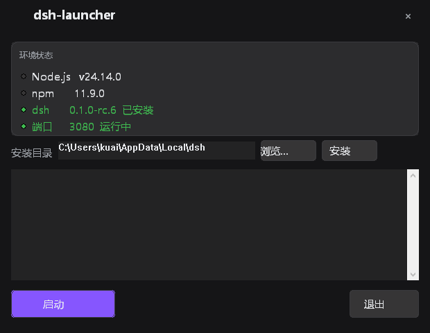

# 🐋 dsh-launcher

[](https://github.com/kuaizhongqiang/dsh-launcher/releases)
[](LICENSE)
[](go.mod)
[](https://github.com/kuaizhongqiang/dsh-launcher/actions)
[]()

本机原生 dsh CLI（[`@deepseek-ai/dsh`](https://www.npmjs.com/package/@deepseek-ai/dsh)，npm 版）的 **Windows 单文件安装 + 启动引导器**。双击即可打开 dsh 风格的深色图形界面：查看环境状态、选择安装目录、安装、一键启动。

> 纯 Go 构建，零运行时依赖。最终产物是一个 `dsh-launcher.exe`，拷到任何 Windows 电脑即可使用。

[English](README.md)

## 截图



## 特性

- 🖥️ **dsh 风格深色 GUI** — 主题色取自 dsh web 界面（背景 `#151517`、品牌蓝 `#5686FE`、12px 圆角）
- ⚡ **一键启动** — 未安装 dsh 时自动引导（目录选择 → 安装 → 启动），已安装则直接拉起服务并打开浏览器
- 🕊️ **独立运行** — dsh 以独立进程运行，关闭启动器窗口**不会**停止 dsh；再次点启动（已在运行）只是重新打开浏览器
- 🛑 **停止 dsh** — 按配置端口定位进程并结束（GUI「停止」按钮 / `stop` 命令）
- 🔀 **挪动 dsh** — 把已安装的 dsh 包挪到任意路径（跨盘自动复制+删除）；dsh 运行中时拒绝移动
- 🔍 **环境状态** — Node.js / npm / dsh 版本、安装状态、端口健康度
- 📜 **实时日志** — 安装与启动输出实时显示在窗口内
- ⌨️ **命令行备用** — `install` / `move` / `start` / `stop` / `status` / `--version` / `--help` 照常可用
- 🐋 **DeepSeek Harness 鲸鱼图标** — 以多尺寸 `.ico` 嵌入 exe
- 🧩 **插件生态** — 以 git 子模块携带 [dsh-plugins](dsh-plugins/) 插件合集；自建插件可通过 PR 贡献

## 环境要求

- **Windows 10 / 11**（x64）
- 目标机器需安装 **Node.js**：`^22.19 || >=24`（仅在运行 dsh 时需要；启动器本身是独立 Go 二进制）
- 目标机器无需 Go、无需 npm 全局配置、无需环境变量

## 下载

从 [Releases 页面](https://github.com/kuaizhongqiang/dsh-launcher/releases) 获取最新 `dsh-launcher.exe`。每次发布由 GitHub Actions 在 `windows-latest` 上自动构建并附带 exe 发布。

## 使用

### 图形界面（双击，推荐）

1. 双击 `dsh-launcher.exe`（或命令行无参运行）。
2. 查看"环境状态"卡片（Node / npm / dsh / 端口）。
3. 点击**启动**：
   - 已安装 dsh → 启动服务（已在运行则直接打开浏览器），按钮变为"已运行"
   - 未安装 → 先点**浏览…**选择安装目录（或直接输入），再点**启动**即可自动安装并启动
4. 需要挪动 dsh 时，点**移动**并选择目标目录（dsh 运行中会拒绝）。
5. 点**停止**结束 dsh；点**退出**只关闭启动器窗口——dsh 继续在后台运行。

> 设 `DSH_LAUNCHER_NO_BROWSER=1` 可跳过自动打开浏览器。

### 命令行

```powershell
dsh-launcher.exe install [--dir <目录>]   # 安装 @deepseek-ai/dsh（默认 %LOCALAPPDATA%\dsh）
dsh-launcher.exe move --dir <目录>        # 把已安装的 dsh 挪到新路径（运行中拒绝）
dsh-launcher.exe start [--no-browser]     # 确保 dsh 运行并打开浏览器（幂等）
dsh-launcher.exe stop                     # 停止 dsh（结束监听端口的进程）
dsh-launcher.exe status                   # 显示安装目录 / 版本 / 运行状态
dsh-launcher.exe --version                # 显示版本
dsh-launcher.exe --help
```

> dsh **独立运行**：`start` 在 dsh 就绪后即返回，启动器退出不影响 dsh；用 `stop` 停止。

日志写入 `%TEMP%\dsh-launcher.log`。

## 配置（launcher.json）

首次 `install` 时生成在 exe 同目录（便携：exe 与配置一起拷走）：

```json
{
  "dshInstallDir": "C:\\Users\\<user>\\AppData\\Local\\dsh",
  "dshVersion": "0.1.0-rc.6",
  "port": 3080,
  "installedAt": "2026-08-15T17:00:00+08:00"
}
```

- **绝不触碰** `~/.dsh`（`DSH_HOME`）— 现有 profile / 插件 / 会话保持原样。
- 新机器上运行 `install` 会覆盖配置中的安装路径。

## 插件生态（dsh-plugins）

dsh 本身支持插件：插件放在 `%DSH_HOME%\profiles\web\plugins\`，通过 profile 的
`cordis.patch.yml` 挂载。本仓库以 **git 子模块**方式携带社区插件合集：

- 本地检出：[`dsh-plugins/`](dsh-plugins/)
- GitHub：[kuaizhongqiang/dsh-plugins](https://github.com/kuaizhongqiang/dsh-plugins)

合集里每个插件包都自包含（`install.ps1` + `plugins/`），并配套一个**安装技能**
（`skills/install-<name>/SKILL.md`），告诉 dsh 的 Agent 如何一步步安装。
技能只装一次，之后在 dsh 会话里直接说需求即可：

```powershell
# 在 dsh-plugins 检出目录下
powershell -ExecutionPolicy Bypass -File .\skills\install-skills.ps1
# 然后在 dsh 会话里说：“安装 describe-image 插件”（或 /install-describe-image）
```

> dsh-launcher **绝不触碰** `~/.dsh`（`DSH_HOME`）：插件的安装与使用与启动器完全独立。

### 贡献自建插件

自建了插件？欢迎回馈合集——向插件合集提交 Pull Request：

1. 把插件做成自包含包：幂等的 `install.ps1` + `plugins/<name>/` + `README.md`
2. 配套安装技能：`skills/install-<name>/SKILL.md`（约定见合集的 `skills/README.md`）
3. 向 [kuaizhongqiang/dsh-plugins](https://github.com/kuaizhongqiang/dsh-plugins) 提交 Pull Request

合并后，刷新本仓库的子模块：

```powershell
git submodule update --remote dsh-plugins
git add dsh-plugins && git commit -m "chore: bump dsh-plugins submodule"
```

## 从源码构建

需要 Go 1.22+。

```powershell
# 一键构建（自动安装 rsrc、生成图标资源、构建 exe）
.\build.ps1 -Version v0.0.1        # 正式版（windowsgui，双击不闪黑框）
.\build.ps1 -Debug                 # 调试版（带控制台，直接看 stdout）
```

手动步骤：

```powershell
go mod tidy
go install github.com/akavel/rsrc@v0.10.2
& (Join-Path (go env GOPATH) 'bin\rsrc.exe') -ico icon.ico -manifest app.manifest -o rsrc.syso
go build -ldflags="-s -w -H windowsgui -X main.guiBuild=1 -X main.version=v0.0.1" -o dsh-launcher.exe .
```

从 SVG 源重新生成图标：

```powershell
go run ./tools/svg2ico favicon.svg icon.ico preview.png
```

## 发布流程

推送 `v*` 标签即触发 [GitHub Actions](.github/workflows/release.yml)：构建 → 冒烟测试（`--version` / `--help`）→ 上传构建产物 → 发布 GitHub Release（附带 exe）：

```powershell
git tag v0.0.1
git push origin v0.0.1
```

## 设计要点

| 决策 | 理由 |
|---|---|
| Go 单 exe | 静态编译、零运行时依赖、双击即用 |
| `npm install -g --prefix <dir>` | 安装目录显式可记录，不污染 npm 全局环境 |
| 配置跟随 exe | 便携：exe + launcher.json 一起拷走 |
| dsh 独立进程 | 启动器退出后 dsh 继续运行；按端口定位停止 |
| `netstat` 端口 → PID → `taskkill` 停止 | 无需守护状态，幂等 |
| 子进程一律 `CREATE_NO_WINDOW` | windowsgui 父进程下 node/npm 不弹控制台黑框 |
| `BeginPaint` / `EndPaint` | 防止 WM_PAINT 风暴（`GetDC` 不清除无效区域） |
| UI 看门狗 | UI 线程卡死 12 秒自动退出（模态对话框豁免） |
| 图标用 `ExtractIconExW` | 不依赖脆弱的资源 ID |

## License

[MIT](LICENSE)
